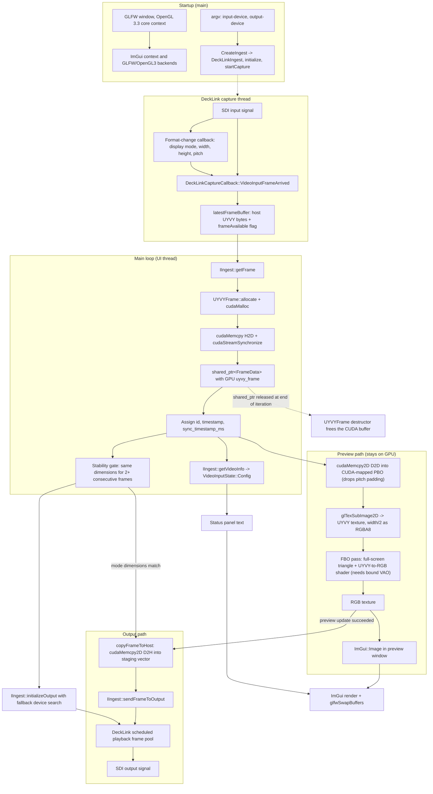

# Televison architecture

## Purpose

Televison receives live UYVY 4:2:2 video from a Blackmagic DeckLink input,
uploads it into a GPU-owned `FrameData::uyvy_frame`, previews it through
CUDA–OpenGL interop, and sends UYVY frames to a DeckLink output. CSV tracking
and frame overlays are currently disabled.

## Whole-application flow chart



Video pixels stay in CUDA device memory from the ingest upload through the
preview render. The only host copy after ingest happens in the output path,
because the DeckLink output API requires CPU-addressable frame bytes.

The output path runs after the preview path for the same frame and is gated on
it: a frame is staged and scheduled for SDI only when `GpuUyvyPreview::update`
reported success for that frame, so a broken preview stops SDI output instead of
letting the two paths diverge. The output still forwards the ingested UYVY
buffer, not the preview's RGB result.

Two details are easy to get wrong when modifying the preview:

- The preview draw call needs a bound vertex array object. The context is an
  OpenGL 3.3 core profile, so `glDrawArrays` without one is invalid and the RGB
  texture stays empty even when capture and SDI output work normally.
- The preview device-to-device copy narrows each row from `pitch` to
  `width × 2`, so the UYVY texture never contains DeckLink row padding, while
  the output path forwards the original padded pitch unchanged.
- `IngestVideoInfo::signal_detected` must not be used to decide whether the
  frame in hand is valid. `DeckLinkCapture::getFrameBuffer` clears the
  frame-available flag when it hands a frame over, so `getVideoInfo` reports
  `signal_detected == false` immediately after a successful `getFrame`. Gating
  output initialization on it makes startup depend on a race with the capture
  callback, which delays SDI output by an arbitrary amount of time.

## Frame contract

`IIngest::getFrame()` returns a `std::shared_ptr<FrameData>`. Each work package
contains:

| Field | Type | Purpose |
| --- | --- | --- |
| `id` | `int` | Application-assigned frame identifier. |
| `uyvy_frame` | `std::unique_ptr<UYVYFrame>` | Exclusive owner of the captured GPU video buffer. |
| `timestamp` | `std::chrono::steady_clock::time_point` | Monotonic local capture timestamp. |
| `sync_timestamp_ms` | `uint64_t` | Wall-clock metadata synchronization timestamp. |
| `module_data` | `std::map<std::type_index, std::any>` | Optional, type-keyed data produced by processing modules. |
| `data_mutex` | `std::mutex` | Protects changes to frame-owned metadata and buffer release. |
| `modules_to_process` | `std::atomic<int>` | Remaining processing-stage count. |

`UYVYFrame` represents packed UYVY 4:2:2 video and is move-only so exactly one
owner releases its CUDA allocation:

| Field | Type | Purpose |
| --- | --- | --- |
| `d_data` | `void*` | CUDA device pointer to packed UYVY pixels. |
| `size` | `size_t` | Allocated/used device-buffer size in bytes. |
| `width`, `height` | `int` | Active image dimensions in pixels. |
| `pitch` | `int` | Source row stride in bytes, including any DeckLink padding. |
| `actual_width_bytes` | `int` | Active UYVY bytes per row (`width × 2`), excluding padding. |

## Components

| Component | Responsibility |
| --- | --- |
| `common/videos/ingestion/src/decklink_capture.cpp` | DeckLink device discovery, capture callbacks, format detection, scheduled SDI playback, genlock status |
| `common/videos/ingestion/src/ingest.cpp` | `IIngest` GPU-frame adapter; retained for application integrations outside the UI executable |
| `common/videos/ingestion/src/main.cpp` | IIngest/FrameData lifecycle, frame metadata, shared state, GPU preview, and output staging |
| `common/videos/ingestion/include/gpu_uyvy_preview.hpp` | CUDA–OpenGL UYVY preview resource interface |
| `common/videos/ingestion/src/gpu_uyvy_preview.cpp` | CUDA PBO mapping, device-to-device UYVY transfer, shader decode, and RGB preview texture |
| `common/videos/ingestion/include/stype_csv_overlay.hpp` | CSV record contract and tracking-overlay interface; not used by the current executable. |
| `common/videos/ingestion/src/stype_csv_overlay.cpp` | Stype HF/FreeD CSV parsing and world-origin gizmo projection; not built into the current executable. |
| `csv/` | Reserved location for tracking recordings; not read by the current executable. |
| `third_party/Decklink-SDK` | DeckLink headers and dynamic API dispatch source |
| `third_party/imgui-package` | Project-local ImGui 1.90.1 package used by the GLFW/OpenGL GUI |

## Operator controls

The right-hand ImGui panel displays the DeckLink input/output status. CSV
selection, CSV plots, tracking state, and the CSV-derived frame overlay are
temporarily disabled; captured `FrameData` therefore passes unchanged to both
the GPU preview and DeckLink output.

Input and output device indices remain command-line arguments:

```bash
decklink_passthrough [input-device=0] [output-device=1]
```

## Runtime requirements

- Blackmagic Desktop Video driver and accessible DeckLink devices.
- A display-capable OpenGL 3.3 environment for GLFW.
- CUDA/OpenGL interop on the same GPU for the preview PBO.
- The output connector must support the detected input mode. An unlocked genlock
  reference does not prevent output, but output is then not reference-synchronized.
- If the requested output device is unavailable, `DeckLinkCapture` tries the
  remaining output-capable devices and the UI reports the device actually selected.

## Device behavior

`decklink_passthrough [input-device=0] [output-device=1]` selects the preferred
DeckLink input and output indices. The input callback detects the active display
mode and updates frame dimensions and pitch. Output starts only after the input
format is stable, then schedules a small bounded frame pool to limit SDI latency.
If the preferred output cannot be used, the application attempts another
output-capable device and reports the selected device. Genlock is used when it
is supported and locked; otherwise, scheduled output continues without reference
synchronization.

## Change rule

`.cursor/rules/architecture-documentation.mdc` requires this document to be
updated whenever application architecture, data flow, controls, dependencies, or
public interfaces change.
