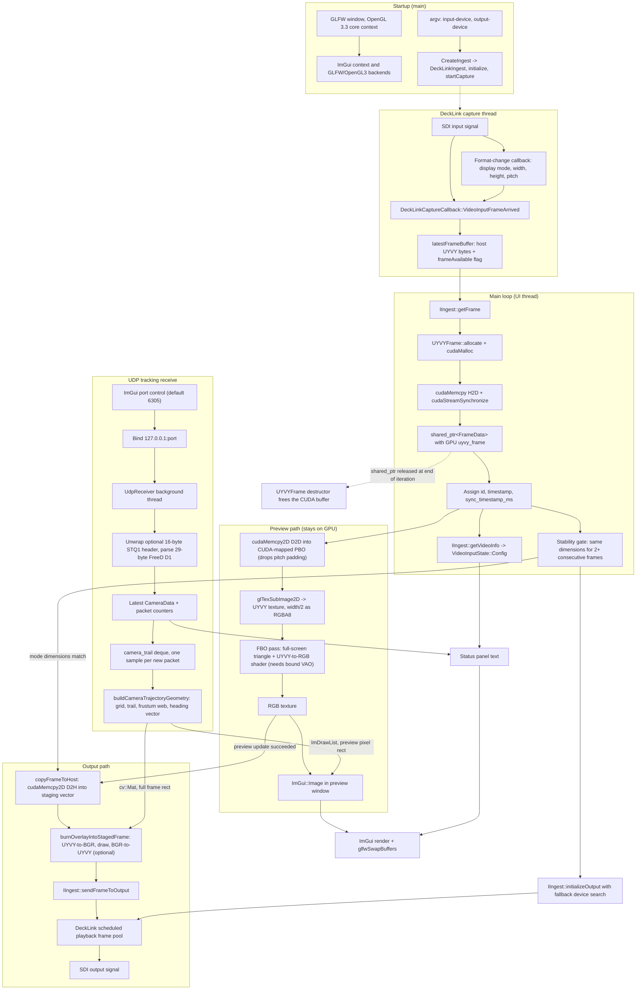

# Televison architecture

## Purpose

Televison receives live UYVY 4:2:2 video from a Blackmagic DeckLink input,
uploads it into a GPU-owned `FrameData::uyvy_frame`, previews it through
CUDA–OpenGL interop, and sends UYVY frames to a DeckLink output. Poses received
over UDP are visualized as a 3D camera-trajectory overlay that is drawn on the
preview and optionally burned into the outgoing SDI pixels. CSV tracking is
currently disabled.

## Whole-application flow chart



Video pixels stay in CUDA device memory from the ingest upload through the
preview render. The only host copy after ingest happens in the output path,
because the DeckLink output API requires CPU-addressable frame bytes.

The output path runs after the preview path for the same frame and is gated on
it: a frame is staged and scheduled for SDI only when `GpuUyvyPreview::update`
reported success for that frame, so a broken preview stops SDI output instead of
letting the two paths diverge. The output forwards the ingested UYVY buffer, not
the preview's RGB result.

The trajectory overlay is the one exception to the GPU-resident rule. When
**Burn into SDI output** is enabled and a valid pose is available, the already
staged host buffer is converted to BGR, drawn on with OpenCV, and converted back
into the same pitched UYVY memory. Two conversions plus the drawing cost about
6 ms per 1080p frame, which fits a 25/50 fps budget but is real CPU work; turning
the burn-in off restores an untouched pass-through. The conversion writes only
the active `width × 2` bytes of each row, so DeckLink row padding is preserved.

The preview does not read the burned frame back. It draws the same geometry with
`ImDrawList` at the preview's own pixel rect, so the operator sees the overlay
even when the burn-in is disabled, and enabling it costs no extra readback.

Two details are easy to get wrong when modifying the preview:

- The preview draw call needs a bound vertex array object. The context is an
  OpenGL 3.3 core profile, so `glDrawArrays` without one is invalid and the RGB
  texture stays empty even when capture and SDI output work normally.
- The preview device-to-device copy narrows each row from `pitch` to
  `width × 2`, so the UYVY texture never contains DeckLink row padding, while
  the output path forwards the original padded pitch unchanged.
- `IngestVideoInfo::signal_detected` must not be used to decide whether the
  frame in hand is valid. `DeckLinkCapture::getFrameBuffer` clears the
  frame-available flag when it hands a frame over, so `getVideoInfo` reports
  `signal_detected == false` immediately after a successful `getFrame`. Gating
  output initialization on it makes startup depend on a race with the capture
  callback, which delays SDI output by an arbitrary amount of time.

## Frame contract

`IIngest::getFrame()` returns a `std::shared_ptr<FrameData>`. Each work package
contains:

| Field | Type | Purpose |
| --- | --- | --- |
| `id` | `int` | Application-assigned frame identifier. |
| `uyvy_frame` | `std::unique_ptr<UYVYFrame>` | Exclusive owner of the captured GPU video buffer. |
| `timestamp` | `std::chrono::steady_clock::time_point` | Monotonic local capture timestamp. |
| `sync_timestamp_ms` | `uint64_t` | Wall-clock metadata synchronization timestamp. |
| `module_data` | `std::map<std::type_index, std::any>` | Optional, type-keyed data produced by processing modules. |
| `data_mutex` | `std::mutex` | Protects changes to frame-owned metadata and buffer release. |
| `modules_to_process` | `std::atomic<int>` | Remaining processing-stage count. |

`UYVYFrame` represents packed UYVY 4:2:2 video and is move-only so exactly one
owner releases its CUDA allocation:

| Field | Type | Purpose |
| --- | --- | --- |
| `d_data` | `void*` | CUDA device pointer to packed UYVY pixels. |
| `size` | `size_t` | Allocated/used device-buffer size in bytes. |
| `width`, `height` | `int` | Active image dimensions in pixels. |
| `pitch` | `int` | Source row stride in bytes, including any DeckLink padding. |
| `actual_width_bytes` | `int` | Active UYVY bytes per row (`width × 2`), excluding padding. |

## Components

| Component | Responsibility |
| --- | --- |
| `common/videos/ingestion/src/decklink_capture.cpp` | DeckLink device discovery, capture callbacks, format detection, scheduled SDI playback, genlock status |
| `common/videos/ingestion/src/ingest.cpp` | `IIngest` GPU-frame adapter; retained for application integrations outside the UI executable |
| `common/videos/ingestion/src/main.cpp` | IIngest/FrameData lifecycle, frame metadata, shared state, GPU preview, and output staging |
| `common/videos/ingestion/include/gpu_uyvy_preview.hpp` | CUDA–OpenGL UYVY preview resource interface |
| `common/videos/ingestion/src/gpu_uyvy_preview.cpp` | CUDA PBO mapping, device-to-device UYVY transfer, shader decode, and RGB preview texture |
| `common/videos/ingestion/include/udp_receiver.hpp` | Local UDP FreeD D1 receiver interface |
| `common/videos/ingestion/src/udp_receiver.cpp` | Background bind/recv thread for `127.0.0.1` (default port 6305), raw packet recording, and FreeD D1 decode of both bare and `STQ1`-wrapped datagrams |
| `udpOut/udp_raw.txt` | Session-local readable UDP recording: one decoded FreeD pose per line |
| `common/videos/ingestion/include/camera_trajectory_overlay.hpp` | Renderer-independent overlay primitives and the ImGui/OpenCV drawing entry points |
| `common/videos/ingestion/src/camera_trajectory_overlay.cpp` | Isometric projection of pose and trail into lines/circles/labels, plus the ImGui and BGR renderers |
| `common/videos/ingestion/include/stype_csv_overlay.hpp` | CSV record contract and tracking-overlay interface; not used by the current executable. |
| `common/videos/ingestion/src/stype_csv_overlay.cpp` | Stype HF/FreeD CSV parsing and world-origin gizmo projection; not built into the current executable. |
| `csv/` | Reserved location for tracking recordings; not read by the current executable. |
| `third_party/Decklink-SDK` | DeckLink headers and dynamic API dispatch source |
| `third_party/imgui-package` | Project-local ImGui 1.90.1 package used by the GLFW/OpenGL GUI |

## Operator controls

The right-hand ImGui panel displays DeckLink input/output status, the UDP
receiver controls, and the trajectory overlay controls. CSV selection, CSV plots,
tracking state, and the CSV-derived frame overlay remain temporarily disabled.

UDP receive:

- bind IP is fixed to local `127.0.0.1` for now;
- port defaults to `6305` and can be changed in the UI with **Apply UDP port**;
- the panel shows listening state, packet counts, bind errors, and the latest
  decoded FreeD D1 pose when a valid packet arrives;
- two datagram shapes are accepted: the bare 29-byte FreeD D1 payload a real
  tracking source sends, and the 45-byte form the Stype simulator produces,
  which prefixes the same payload with a 16-byte sync header of `"STQ1"`, a
  little-endian `uint32` frame id, and a little-endian `uint64` timestamp.
  Rejecting the wrapped form leaves the overlay permanently blank, because it
  only draws once a pose has decoded;
- every valid FreeD datagram is decoded into a readable line containing camera
  ID, pan, tilt, roll, X/Y/Z millimetres, zoom, and focus in
  `/home/quidich/Televison/udpOut/udp_raw.txt`. Invalid datagrams are retained as
  decimal byte values. Starting the application or applying a UDP port starts a
  new session and truncates the previous file before receiving packets.

Trajectory overlay:

- **Show overlay** enables the visualization; it is drawn only while a valid
  FreeD pose has been received;
- **Burn into SDI output** decides whether the outgoing frames carry the overlay.
  The preview always shows it, so this toggle only changes what leaves the card;
- **Ground grid** toggles the floor grid and world axes, and **Ground plane**
  sets the height they sit at, which is viz3d's `world_origin_y_mm`;
- **Frustum web** toggles the camera cone. While it is on, **Cone angle** sets
  the half-angle between 1 and 60 degrees, **Web length** sets the ray length as
  1 to 100 percent of the framed trail span, and **Reset frustum** restores the
  `viz3d.py` defaults of 14 degrees and 15 percent. Both sliders grey out when
  the web is off;
- **Trail length** caps the retained pose history (default 1000 samples, one per
  new packet), and **Clear trail** discards it;
- left-clicking the preview picture places the scene at that point, and
  **Centre scene** returns it to the middle of the frame. The click is recorded
  in normalized coordinates, so the burned SDI frame matches the preview.

Pose telemetry is deliberately not drawn on the video. It is reported in the UDP
section of the panel, in the same fields viz3d puts in its read-out bar: camera
id, zoom and focus, pan/tilt/roll, X / Y / Z(depth) in metres, and the ground
distance to the world origin.

The visualization is an isometric 3D view that follows the conventions of
`stype_sim/viz3d.py`, so the two show the same scene:

- world **Y is height**; plot space is `(world X, world Z, world Y)`. Treating
  world Z as up tips the whole scene on its side;
- the camera basis is built exactly as `projection.build_camera_basis` does
  (look/right/down, with roll applied to the right vector by Rodrigues) and is
  then swapped into plot space;
- the frustum is a cone of 8 rays at a 14 degree half-angle joined by a rim,
  which is the "spider web" shape, not a rectangular pyramid;
- the trail runs along the `cool` colormap, cyan for the oldest sample through
  magenta for the newest, and the camera marker is orange.

Every length is a fraction of the framed trail rather than a fixed distance:
the frustum defaults to 15% and the heading arrow to 20% of the trail span,
matching the reference's 6 m and 8 m against a roughly 40 m trail. The ground
grid spacing snaps to a 1/2/5 x 10^n step covering about a fifth of the span.
This matters because real tracking data ranges from a few metres in a studio to
the tens of metres seen on the SDI feed here; fixed sizes collapse to invisible
specks at stadium scale.

### The scene is static, the camera moves

viz3d splits its drawing into a static layer (trail, grid, origin, and the axis
limits) that is re-rendered only when the trail grows substantially, and a
dynamic layer (camera marker, look arrow, frustum) redrawn every tick. The
overlay reproduces that split without the caching: the projection is derived
**only from the trail bounds**, padded exactly as viz3d pads its axis limits, so
the live pose has no influence on the framing. The camera marker, arrow, and
cone then travel across a stationary grid.

This is load-bearing. Fitting the projection to the live pose instead makes the
grid and trail slide around underneath a camera that appears pinned, which reads
as the world moving rather than the camera. With the trail held fixed and only
the pose advancing, the world origin and grid stay put to within 0.01 px while
the camera marker travels several hundred pixels.

The scene's position on screen is the operator's to choose: `anchor_u`/`anchor_v`
place the centre of the padded view box, and the projection scale is then the
largest that still fits that box into the picture-safe area, measured as the room
on each side of the anchor. The anchor is clamped to keep at least 12% of the
content box on every side. An anchor pushed into a corner therefore shrinks the
drawing, which is the intended trade-off; flooring the room instead of the anchor
would let the drawing spill out of frame.

The ground grid and world origin axes may still extend past the fitted box and
are clipped to the video rectangle, mirroring how the reference sets its limits
from the trail while drawing its grid wider.

Input and output device indices remain command-line arguments:

```bash
decklink_passthrough [input-device=0] [output-device=1]
```

## Runtime requirements

- Blackmagic Desktop Video driver and accessible DeckLink devices.
- A display-capable OpenGL 3.3 environment for GLFW.
- CUDA/OpenGL interop on the same GPU for the preview PBO.
- The output connector must support the detected input mode. An unlocked genlock
  reference does not prevent output, but output is then not reference-synchronized.
- If the requested output device is unavailable, `DeckLinkCapture` tries the
  remaining output-capable devices and the UI reports the device actually selected.

## Device behavior

`decklink_passthrough [input-device=0] [output-device=1]` selects the preferred
DeckLink input and output indices. The input callback detects the active display
mode and updates frame dimensions and pitch. Output starts only after the input
format is stable, then schedules a small bounded frame pool to limit SDI latency.
If the preferred output cannot be used, the application attempts another
output-capable device and reports the selected device. Genlock is used when it
is supported and locked; otherwise, scheduled output continues without reference
synchronization.

## Change rule

`.cursor/rules/architecture-documentation.mdc` requires this document to be
updated whenever application architecture, data flow, controls, dependencies, or
public interfaces change.
